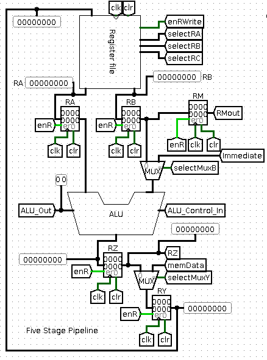
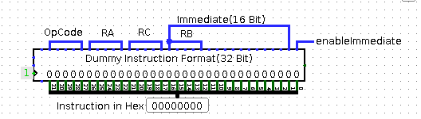
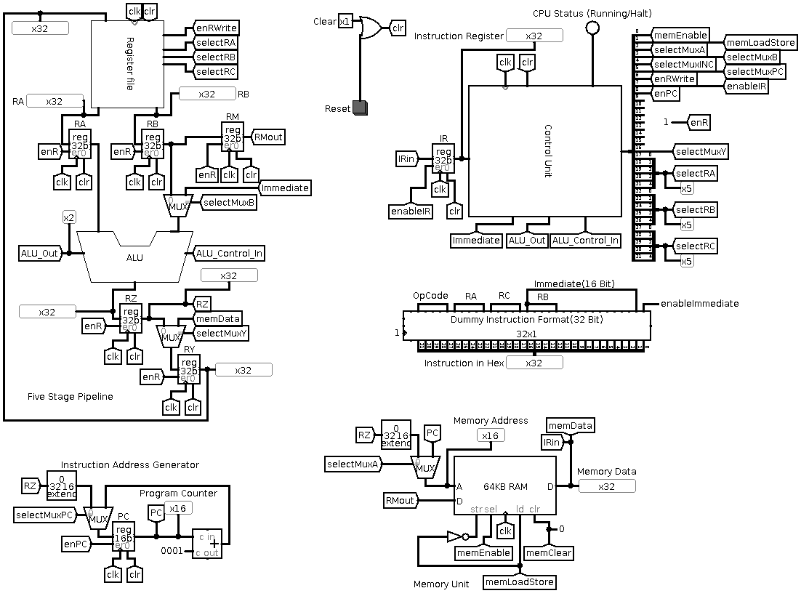
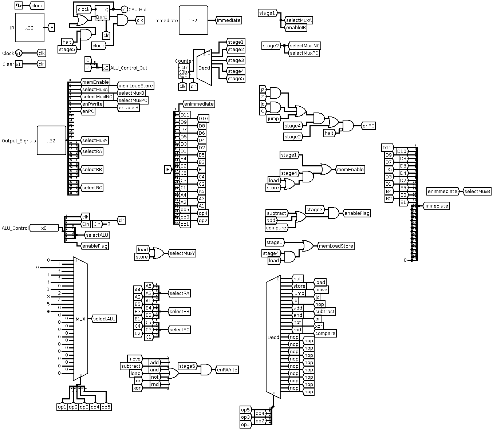
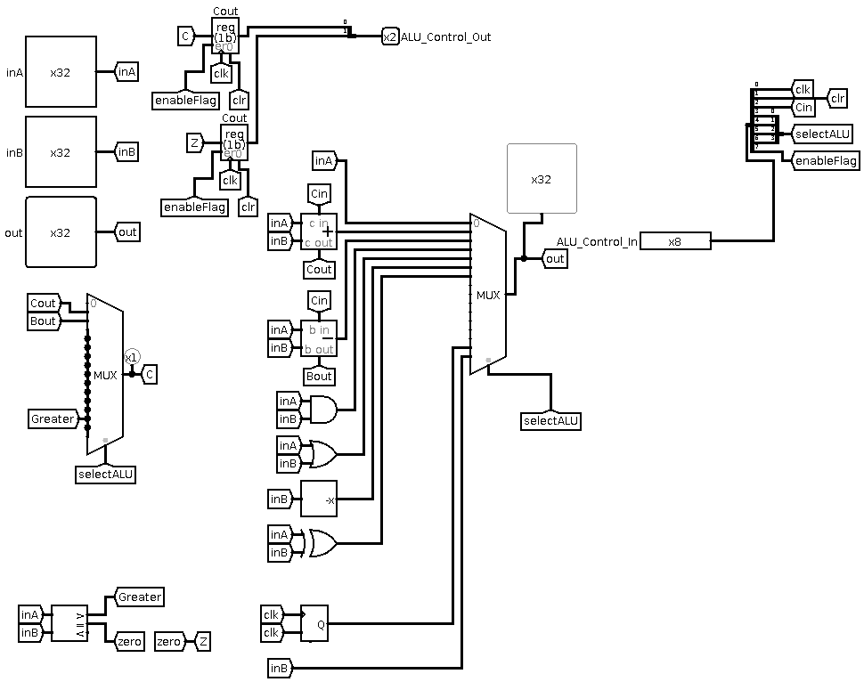
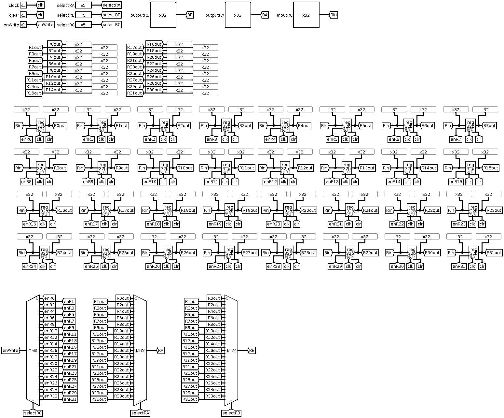

# 32-Bit RISC Processor and Assembler - A Simulation using Logism

## Features
- Dual Port Register File with 32 General Purpose Registers of 32-Bit word length.
- 256KB RAM with a 16-Bit address bus and 32-Bit word size
- Assembler Program written in Python to convert high level assembly language to machine specific instructions.
- Five stage pipeline.
- Automatic Instruction Fetch and Halt on program complete.
- Arithmetic, Boolean and Conditional Jump Instructions
- Hardwired Control Unit

## Five Stage Pipeline
	
1. Instruction Fetch
2. Instruction Decode, Increment Program Counter and Register Read
3. ALU Operations
4. Memory Access
5. Register Write
## Instruction Set
### Instruction Format

### Register Instructions
 OpCode | Immediate Bit | Operation | RTN  
---  | :---:|:---:|:---:
0000 | 0 | Halt 			| ```                               ``` |
0001 | 0 | Load 			| ```RC <-- [[RB]]                  ``` |
0010 | 0 | Store            | ```[RA] <-- [RB]                  ``` |
0011 | 0 | Move 			| ```RC <-- RA                      ``` |
0100 | 0 | Jump	        	| ```PC <-- [RB]                    ``` |
0101 | 0 | Jump If Zero     | ```PC <-- [RB] if Z=1             ``` |
0110 | 0 | Jump If Carry    | ```PC <-- [RB] if C=1             ``` |
0111 | 0 | No Op    		| ```                               ``` |
1000 | 0 | Add       		| ```RC <-- [RA]+[RB]               ``` |
1001 | 0 | Subtract         | ```RC <-- [RA]-[RB]               ``` |
1010 | 0 | And       		| ```RC <-- [RA] AND [RB]           ``` |
1011 | 0 | OR       		| ```RC <-- [RA] OR [RB]            ``` |
1100 | 0 | NOT       		| ```RC <-- NOT [RA]                ``` |
1101 | 0 | XOR       		| ```RC <-- [RA] XOR [RB]           ``` |
1110 | 0 | Random Number    | ```RC <-- Random                  ``` |
1111 | 0 | Compare        	| ```C <-- [RA]>[RB], Z<--[RA]==[RB]```|
### Immediate Instructions
 OpCode | ImmediateBit | Operation | RTN  
---  | :---:|:---:|:---:
0001 |1 | Load 		    	| ``` RC <-- [I]                ```|
0011 |1 | Move 			    | ``` RC <-- I                  ```|
0100 |1 | Jump  		    | ``` PC <-- I                  ```|
0101 |1 | Jump If Zero      | ``` PC <-- I if Z=1           ```|
0110 |1 | Jump If Carry     | ``` PC <-- I if C=1           ```|
1000 |1 | Add       		| ``` RC <-- [RA]+I             ```|
1001 |1 | Subtract          | ``` RC <-- [RA]-I             ```|
1010 |1 | And       		| ``` RC <-- [RA] AND I         ```|
1011 |1 | OR       		    | ``` RC <-- [RA] OR  I         ```|
1101 |1 | XOR       		| ``` RC <-- [RA] XOR I         ```|
1111 |1 | Compare        	| ``` C <-- [RA]>I, Z<--[RA]==I ```|


## Components
### Main Circuit


-------

### Control Unit


------

### Arithmetic Logic Unit


------

### Register File
	

------

## Assembler
- A python based assembler script is included with the processor. The assembler converts high level assembly language into machine instructions and outputs a Logism memory image. Load this memory image into the simulator to run the program. See assembler documentation file for more details.